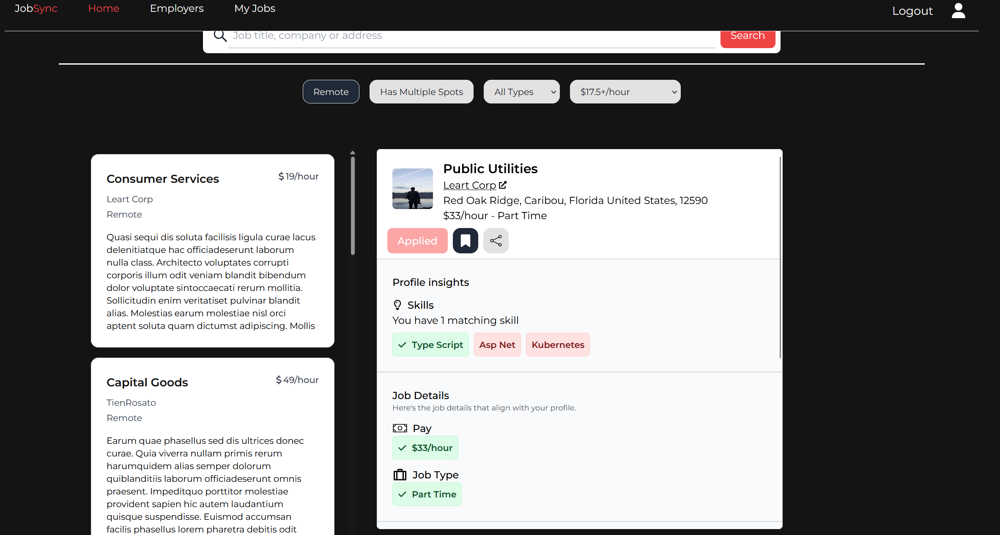
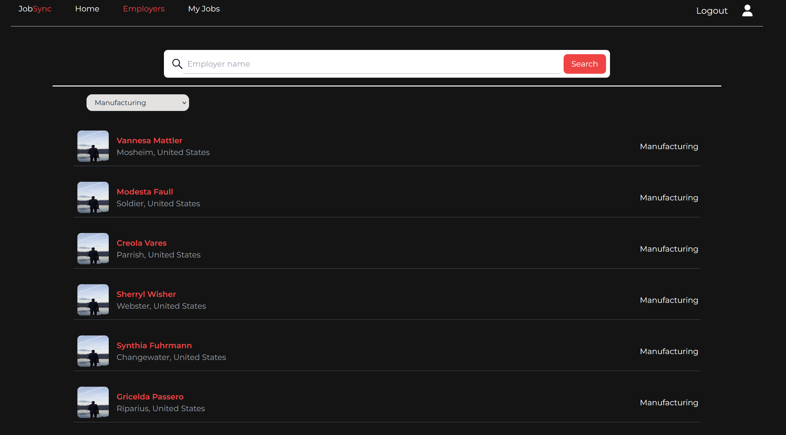
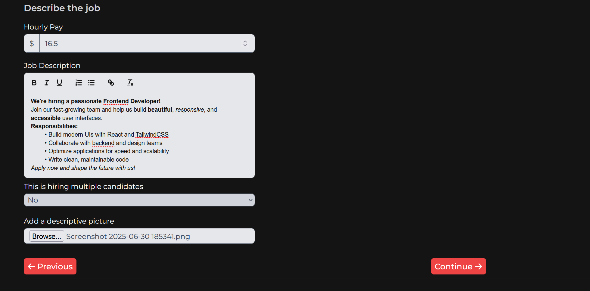
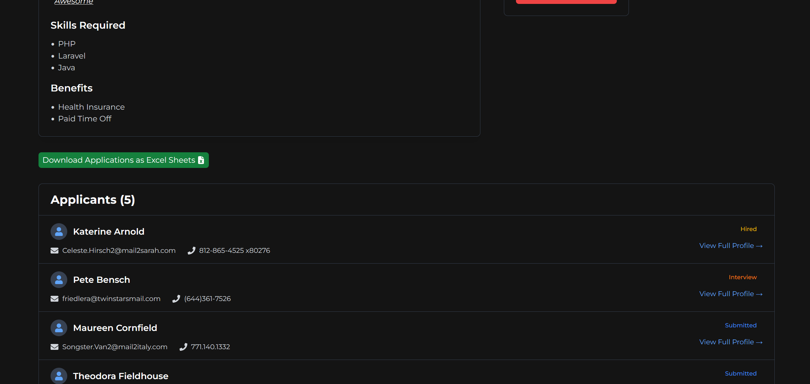
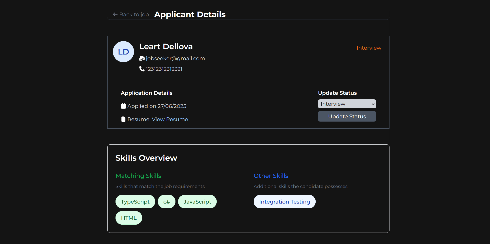
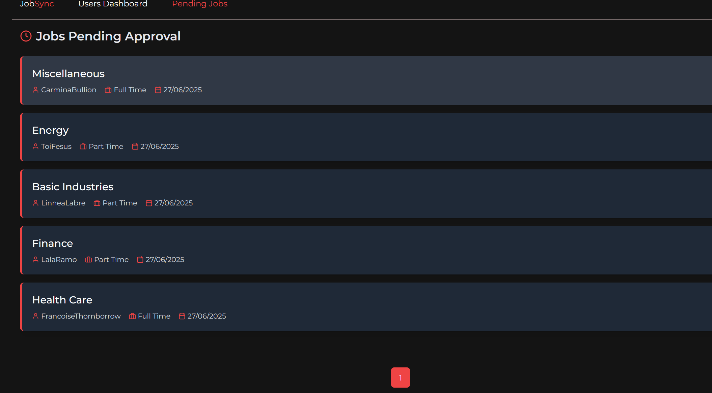
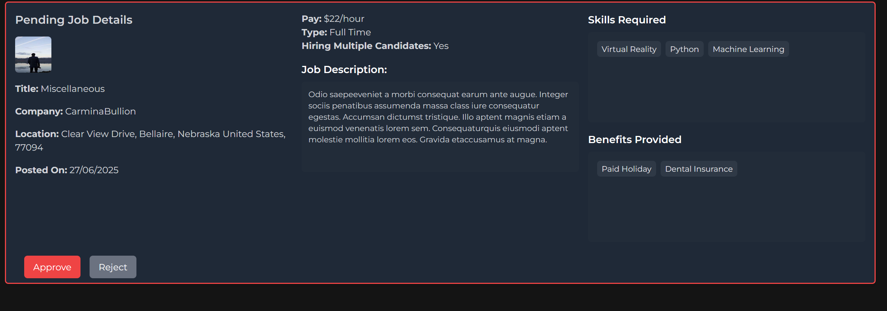
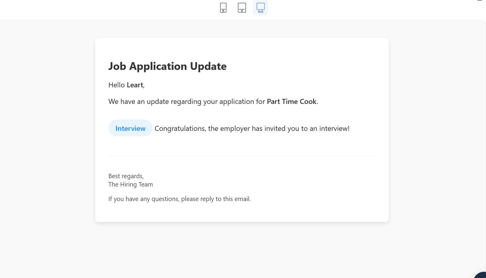

# JobSyncProject
A modern job marketplace web application built with **ASP.NET Core Web API**, **React.js**, **TypeScript**, and **TailwindCSS**.

## ✨ Features

- 🔍 Job listings with filtering, searching, pagination and data shaping
- 📝 Resume & application management
- 🏢 Employer dashboard with analytics
- 📝 WYSIWYG editor (React Quill) for rich-text job descriptions
- 📁 Application data exporting to Excel (.xlsx)
- 🛠 Admin panel for managing users and reviewing pending jobs
- 🧾 Resource and role based authorization with JWT 
- 📷 Cloudinary integration for image and resume uploads
- 📧 Mailtrap service for email notifications
- 🔒 Rate limiting with Redis
- 🔍 Data validation with FluentValidation (Back) & Zod (Front)

---

## 🖼️ Screenshots

